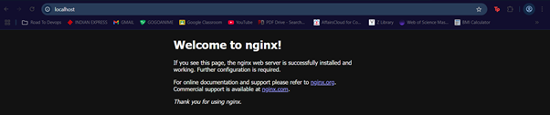
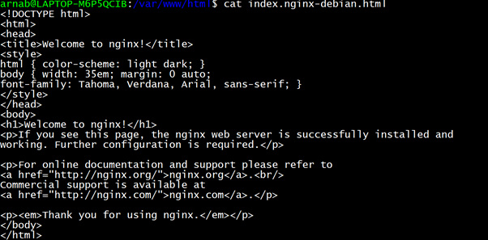
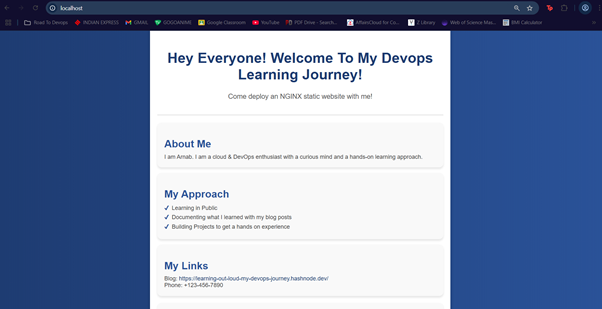

# NGINX Web Server Setup on Ubuntu (DevOps Project)

This guide walks through the steps taken to set up a simple NGINX web server on an Ubuntu machine. We installed NGINX, explored its configuration, and deployed a custom static website.

---

## Prerequisites

- Ubuntu system (local or cloud-based like AWS EC2)
- sudo privileges
- Internet access

---

## Steps Performed

### Step 1: Update System Package Index

```bash
sudo apt update


### Step 2: Install NGINX Web Server

```bash
sudo apt install nginx
```

When prompted, confirm installation with `Y`. This installs the NGINX HTTP server.

---

### Step 3: Check NGINX Status

```bash
systemctl status nginx
```

Look for `active (running)` to confirm the service is up.

---

### Step 4: Access NGINX via Public IP

* Open a browser and enter your **public IP address** (e.g. `http://<your-ip>`)
* By default, NGINX listens on port `80`, so no need to specify a port.

---

### Step 5: Confirm Default NGINX Page

You should see the **"Welcome to nginx!"** default page.
This confirms NGINX is installed and accessible.

---


### Step 6: Understand the Web Root Directory

The default directory NGINX serves files from is:

```bash
/var/www/html
```

Any file you place here will be served when someone visits your site.

---

### Step 7: View the Default HTML Page

```bash
cat /var/www/html/index.nginx-debian.html
```

This file contains the HTML code for the default NGINX welcome page.

---

### Step 8: Explore NGINX Configuration Structure

Navigate to the NGINX configuration directory:

```bash
cd /etc/nginx
```

Important components:

* `nginx.conf`: Main configuration file.
* `sites-available/`: Stores available site configs.
* `sites-enabled/`: Stores symlinks to active site configs.

💡 Only configs inside `sites-enabled/` are active.

---

### Step 9: Inspect the Active Site Configuration

```bash
cd /etc/nginx/sites-enabled
ls
vim default
```

The `default` file is the active configuration. It includes:

```nginx
root /var/www/html;
```

This line tells NGINX to serve files from `/var/www/html`.

---

### Step 10: Understand the `root` Directive

The `root` path in the config determines the directory NGINX uses to serve content.
By default, it's:

```nginx
root /var/www/html;
```

That’s why your browser loads the files you place there.

---

### Step 11: Create a Custom HTML Page

Navigate to the web root:

```bash
cd /var/www/html
sudo vim index.html
```

Write the custom HTML and CSS content.

Example snippet:

```html
Refer the index.html file
```

Save and exit.

---

### Step 12: Verify the Custom Page in Browser

* Open the browser
* Visit:

```bash
http://localhost
```

or

```bash
http://<your-public-ip>
```

We should now see your custom page instead of the default "Welcome to nginx" page.

